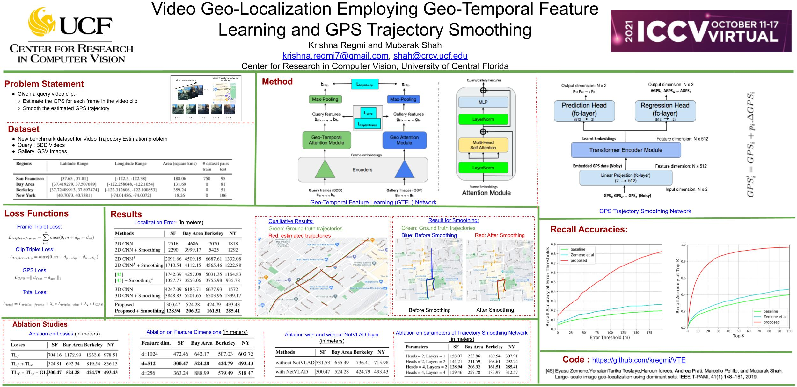

# VTE

[[Paper, ICCV 2021](https://openaccess.thecvf.com/content/ICCV2021/papers/Regmi_Video_Geo-Localization_Employing_Geo-Temporal_Feature_Learning_and_GPS_Trajectory_Smoothing_ICCV_2021_paper.pdf)]

## Poster



## Setup

### Getting Started
- Install PyTorch and its dependencies: 

`conda install pytorch torchvision torchaudio cudatoolkit=10.2 -c pytorch`


- Clone this repo:
```bash
https://github.com/kregmi/VTE.git
cd VTE
```


## Code

### GeoTemporalFeatureLearning: 
Code to conduct geo-temporal feature learning. 
The `encoder` consists of code for 2D CNN backbone. The `temporalAttention` consists of the implementation of transformer-based attention module.


- Training/Testing the model

Training is done in two stages. 

```bash
First, train the `encoder` module using the `main.py` file.
Save the encoder featues using the `test_bdd.py` file.
```

```bash
Second, train the `temporalAttention` module using the `train.py` file.
Use `eval.py` to evaluate the trained model. 
```
Additional instruction is provided within each module's README.


### TrajectorySmoothingNetwork: 
Code to train/test the `trajectory smoothing network`.

- Training/Testing the model

```bash
`train.py` contains the code for training. 
`eval.py` contains the code for testing.
```

## Dataset

BDD videos are downloaded from the [official BDD website](https://bdd-data.berkeley.edu/).

The corresponding Google StreetView Images are downloaded using [Google Cloud Platform](https://console.cloud.google.com/apis/).

Please contact us for additional instruction to obtain the dataset used in this work. 


## Citation
If you find our works useful for your research, please cite our work: 

- Video Geo-Localization Employing Geo-Temporal Feature Learning and GPS Trajectory Smoothing, ICCV 2021, [pdf](https://openaccess.thecvf.com/content/ICCV2021/papers/Regmi_Video_Geo-Localization_Employing_Geo-Temporal_Feature_Learning_and_GPS_Trajectory_Smoothing_ICCV_2021_paper.pdf), [bibtex](https://github.com/kregmi/VTE/tree/master/resources/bibtex_iccv2021.txt)


## Questions

Please contact: `krishna.regmi7@gmail.com`
